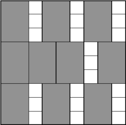
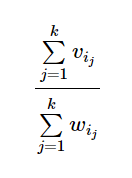

# y2019-1-1. Сортировки, куча, бинпоиск  

## A. Простая сортировка  
ограничение по времени на тест: 2 секунды  
ограничение по памяти на тест: 64 мегабайта  
ввод: стандартный ввод  
вывод: стандартный вывод  

Дан массив целых чисел. Ваша задача — отсортировать его в порядке неубывания.  

### Входные данные  
В первой строке входного файла содержится число ___N___ (1 ≤ ___N___ ≤ 100 000) — количество элементов в массиве. Во второй строке находятся ___N___ целых чисел, по модулю не превосходящих 109.  

### Выходные данные  
В выходной файл надо вывести этот же массив в порядке неубывания, между любыми двумя числами должен стоять ровно один пробел.  

### Пример  
#### Входные данные
`10`  
`1 8 2 1 4 7 3 2 3 6` 

#### Выходные данные
`1 1 2 2 3 3 4 6 7 8`

### Примечание
Запрещается использовать стандартные сортировки.

## B. Сортировка подсчетом
ограничение по времени на тест: 1 секунда  
ограничение по памяти на тест: 64 мегабайта  
ввод: стандартный ввод  
вывод: стандартный вывод  

Дан список из ___N___ элементов, которые принимают целые значения от 0 до 100. Отсортируйте этот список в порядке неубывания элементов. Выведите полученный список.

### Входные данные
На одной строке дан массив из ___N___ элементов. (1 ≤ ___N___ ≤ 2·105) — количество элементов в массиве. Гарантируется, что все элементы массива принимают целые значения от 0 до 100.

### Выходные данные
Выведите отсортированный список элeментов

### Пример
#### Входные данные
`7 3 4 2 5`
#### Выходные данные
`2 3 4 5 7`
### Примечание
Использовать встроенные функции сортировки нельзя.

## C. Количество инверсий
ограничение по времени на тест: 5 секунд  
ограничение по памяти на тест: 256 мегабайт  
ввод: стандартный ввод  
вывод: стандартный вывод  

Напишите программу, которая для заданного массива  находит количество пар (___i___, ___j___) таких, что ___i___ < ___j___ и ___a___i > ___a___j.

### Входные данные
Первая строка входного файла содержит натуральное число ___n___ (1 ≤ ___n___ ≤ 500 000) — количество элементов массива. Вторая строка содержит ___n___ попарно различных элементов массива ___A___ (0 ≤ ___a___i ≤ 106).

### Выходные данные
В выходной файл выведите одно число — ответ на задачу.

### Примеры
#### Входные данные
`4`  
`1 2 4 5`
#### Выходные данные
`0`
#### Входные данные
`4`  
`5 4 2 1`
#### Выходные данные
`6`

## D. Хипуй!
ограничение по времени на тест: 3 секунды  
ограничение по памяти на тест: 256 мегабайт  
ввод: стандартный ввод  
вывод: стандартный вывод  

В этой задаче вам необходимо организовать структуру данных Heap для хранения целых чисел, над которой определены следующие операции:

Insert(___X___) — добавить в Heap число ___X___;  
Extract — достать из Heap наибольшее число (удалив его при этом).  
Эту задачу нужно решить без использования встроенных структур данных для поиска максимального числа.  

### Входные данные
Во входном файле записано количество команд ___N___ (1 ≤ ___N___ ≤ 100 000), потом последовательность из ___N___ команд, каждая в своей строке.

Каждая команда имеет такой формат: "0 <число>" или "1", что означает соответственно операции ___Insert(<число>)___ и ___Extract___. Добавляемые числа находятся в интервале от 1 до 107 включительно.

Гарантируется, что при выполнении команды ___Extract___ в структуре находится по крайней мере один элемент.

### Выходные данные
В выходной файл для каждой команды извлечения необходимо вывести число, полученное при выполнении команды ___Extract___.

### Пример
#### Bходные данные
`7`  
`0 100`  
`0 10`   
`1 ` 
`0 5`  
`0 30`  
`0 50`  
`1`  
#### Bыходные данные
`100`  
`50`  

## E. Быстрый поиск в массиве
ограничение по времени на тест: 1 секунда  
ограничение по памяти на тест: 256 мегабайт  
ввод: стандартный ввод  
вывод: стандартный вывод  
Дан массив из ___n___ целых чисел. Все числа от  -109 до 109.  

Нужно уметь отвечать на запросы вида "Cколько чисел имеют значения от ___l___ до ___r___?".  

### Входные данные  
Число n (1 ≤ ___n___ ≤ 105). Далее ___n___ целых чисел.  

Затем число запросов ___k___ (1 ≤ ___k___ ≤ 105).  

Далее ___k___ пар чисел ___l___, ___r___ ( -109 ≤ ___l___ ≤ ___r___ ≤ 109) — собственно запросы.  

### Выходные данные
Выведите k чисел — ответы на запросы.  

#### Пример
#### Bходные данные
`5`  
`10 1 10 3 4`  
`4`  
`1 10`  
`2 9`  
`3 4`  
`2 2`  
#### Bыходные данные
`5 2 2 0`  

## G. Очень Легкая Задача
ограничение по времени на тест: 2 секунды  
ограничение по памяти на тест: 256 мегабайт  
ввод: стандартный ввод  
вывод: стандартный вывод  

Сегодня утром жюри решило добавить в вариант олимпиады еще одну, Очень Легкую Задачу. Ответственный секретарь Оргкомитета напечатал ее условие в одном экземпляре, и теперь ему нужно до начала олимпиады успеть сделать еще ___n___ копий. В его распоряжении имеются два ксерокса, один из которых копирует лист за ___x___ секунд, а другой – за ___y___. (Разрешается использовать как один ксерокс, так и оба одновременно. Можно копировать не только с оригинала, но и с копии.) Помогите ему выяснить, какое минимальное время для этого потребуется.

### Входные данные
На вход программы поступают три натуральных числа ___n___, ___x___ и ___y___, разделенные пробелом (1 ≤ ___n___ ≤ 2·108, 1 ≤ ___x___, ___y___ ≤ 10).

### Выходные данные
Выведите одно число – минимальное время в секундах, необходимое для получения n копий.

### Примеры
#### Bходные данные
`4 1 1`  
#### Bыходные данные
`3`  
#### входные данные
`5 1 2`  
#### выходные данные
`4`  

## H. Дипломы
ограничение по времени на тест: 1 секунда
ограничение по памяти на тест: 256 мегабайт
ввод: стандартный ввод
вывод: стандартный вывод

Когда Петя учился в школе, он часто участвовал в олимпиадах по информатике, математике и физике. Так как он был достаточно способным мальчиком и усердно учился, то на многих из этих олимпиад он получал дипломы. К окончанию школы у него накопилось n дипломов, причём, как оказалось, все они имели одинаковые размеры: ___w___ — в ширину и ___h___ — в высоту.

Сейчас Петя учится в одном из лучших российских университетов и живёт в общежитии со своими одногруппниками. Он решил украсить свою комнату, повесив на одну из стен свои дипломы за школьные олимпиады. Так как к бетонной стене прикрепить дипломы достаточно трудно, то он решил купить специальную доску из пробкового дерева, чтобы прикрепить её к стене, а к ней — дипломы. Для того чтобы эта конструкция выглядела более красиво, Петя хочет, чтобы доска была квадратной и занимала как можно меньше места на стене. Каждый диплом должен быть размещён строго в прямоугольнике размером ___w___ на ___h___. Дипломы запрещается поворачивать на 90 градусов. Прямоугольники, соответствующие различным дипломам, не должны иметь общих внутренних точек.  
  
Требуется написать программу, которая вычислит минимальный размер стороны доски, которая потребуется Пете для размещения всех своих дипломов.

### Входные данные
Входной файл содержит три целых числа: ___w___, ___h___, ___n___ (1≤ ___w___, ___h___, ___n___ ≤ 109).

### Выходные данные
В выходной файл необходимо вывести ответ на поставленную задачу.  

### Пример
#### Bходные данныеать
`2 3 10`
#### Bыходные данные
`9`  

## I. Квадратный корень и квадратный квадрат
ограничение по времени на тест: 2 секунды  
ограничение по памяти на тест: 256 мегабайт  
ввод: стандартный ввод  
вывод: стандартный вывод  

<<<<<<< HEAD
<<<<<<< HEAD
Найдите такое число ___x___, что  , с точностью не менее 6 знаков после точки.  
=======
Найдите такое число ___x___, что  , с точностью не менее 6 знаков после точки.  
>>>>>>> bc02c8e11bb778cf1e675274e888c56ce0816013
=======
Найдите такое число ___x___, что  , с точностью не менее 6 знаков после точки.  
>>>>>>> bc02c8e11bb778cf1e675274e888c56ce0816013

### Входные данные  
В единственной строке содержится вещественное число 1.0 ≤ ___C___ ≤ 1010.  

### Выходные данные  
Выведите одно число — искомый ___x___.

### Примеры  
#### Bходные данные  
`2.0000000000`  
#### Bыходные данные  
`1.0`  
#### Bходные данные  
`18.0000000000`  
#### Bыходные данные  
`4.0`  

## J. Поляна дров
ограничение по времени на тест: 2 секунды  
ограничение по памяти на тест: 256 мегабайт  
ввод: стандартный ввод  
вывод: стандартный вывод  

Маленький мальчик Ферма живет в деревне. Наступают холодные времена, поэтому бабушка попросила мальчика сходить в лес, чтобы собрать дров. В лесу около деревни, в которой живет Ферма, находится волшебная Поляна Дров, на которой всегда лежат дрова, и никогда не кончаются. Естественно, Ферма должен пойти именно туда.  

Единственная проблема заключается в том, что идти до Поляны не очень близко, тем более что скорость передвижения по лесу намного меньше, чем скорость передвижения по полю, в котором находится деревня.  
<ul>
  <li>Деревня находится в точке с координатами  (0, 1).</li>  
  <li>Поляна находится в точке с координатами  (1, 0).</li>  
  <li>Граница между лесом и полем — горизонтальная прямая <strong><em>y</em></strong> = <strong><em>a</em></strong>, где <strong><em>a</em></strong> — некоторое число (0 ≤ <strong><em>a</em></strong> ≤ 1).</li>  
</ul>  

Скорость передвижения по полю составляет ___V___p, скорость передвижения по лесу — ___V___f. Вдоль границы можно двигаться как по лесу, так и по полю.  

Найдите точку, в которой мальчик Ферма должен войти в лес, чтобы дойти до Поляны Дров как можно быстрее.   

### Входные данные
В первой строке входного файла содержатся два положительных целых числа — ___V___p и ___V___f (1 ≤ ___V___p, ___V___f ≤ 105). Во второй строке содержится единственное вещественное число — координата по оси Oy границы между лесом и полем ___a___ (0 ≤ ___a___ ≤ 1)  

### Выходные данные  
В единственной строке выходного файла выведите вещественное число с точностью не менее 4 знаков после запятой — координата по оси Ox точки, в которой мальчик Ферма должен войти в лес.  

### Пример
#### Bходные данные
`5 3`  
`0.4`  
#### Bыходные данные
`0.783310604`  

## K. K-best
ограничение по времени на тест: 2 секунды  
ограничение по памяти на тест: 256 мегабайт  
ввод: стандартный ввод  
вывод: стандартный вывод  

<<<<<<< HEAD
<<<<<<< HEAD
У Демьяны есть ___n___ драгоценностей. Каждая из драгоценностей имеет ценность ___v___i и вес ___w___i. С тех пор, как её мужа Джонни уволили в связи с последним финансовым кризисом, Демьяна решила продать несколько драгоценностей. Для себя она решила оставить лишь ___k___ лучших. Лучших в смысле максимизации достаточно специфического выражения: пусть она оставила для себя драгоценности номер ___i___1, ___i___2, …, ___i___k, тогда максимальной должна быть величина    
=======
У Демьяны есть ___n___ драгоценностей. Каждая из драгоценностей имеет ценность ___v___i и вес ___w___i. С тех пор, как её мужа Джонни уволили в связи с последним финансовым кризисом, Демьяна решила продать несколько драгоценностей. Для себя она решила оставить лишь ___k___ лучших. Лучших в смысле максимизации достаточно специфического выражения: пусть она оставила для себя драгоценности номер ___i___1, ___i___2, …, ___i___k, тогда максимальной должна быть величина  
  
>>>>>>> bc02c8e11bb778cf1e675274e888c56ce0816013
=======
У Демьяны есть ___n___ драгоценностей. Каждая из драгоценностей имеет ценность ___v___i и вес ___w___i. С тех пор, как её мужа Джонни уволили в связи с последним финансовым кризисом, Демьяна решила продать несколько драгоценностей. Для себя она решила оставить лишь ___k___ лучших. Лучших в смысле максимизации достаточно специфического выражения: пусть она оставила для себя драгоценности номер ___i___1, ___i___2, …, ___i___k, тогда максимальной должна быть величина  
  
>>>>>>> bc02c8e11bb778cf1e675274e888c56ce0816013

Помогите Демьяне выбрать k драгоценностей требуемым образом.  

### Входные данные  
На первой строке n и k (1 ≤ ___k___ ≤ ___n___ ≤ 100 000).  

Следующие n строк содержат пары целых чисел  ___v___i,  ___w___i (0 ≤  ___v___i ≤ 106,1 ≤  ___w___i ≤ 106, сумма всех  ___v___i не превосходит 107, сумма всех ___w___i также не превосходит 107).

### Выходные данные  
Выведите ___k___ различных чисел от 1 до ___n___ — номера драгоценностей. Драгоценности нумеруются в том порядке, в котором перечислены во входных данных. Если есть несколько оптимальных ответов, выведите любой.  

### Примеры  
#### Bходные данные
`3 2`  
`1 1`  
`1 2`  
`1 3`  
#### Bыходные данные
`1`  
`2`
